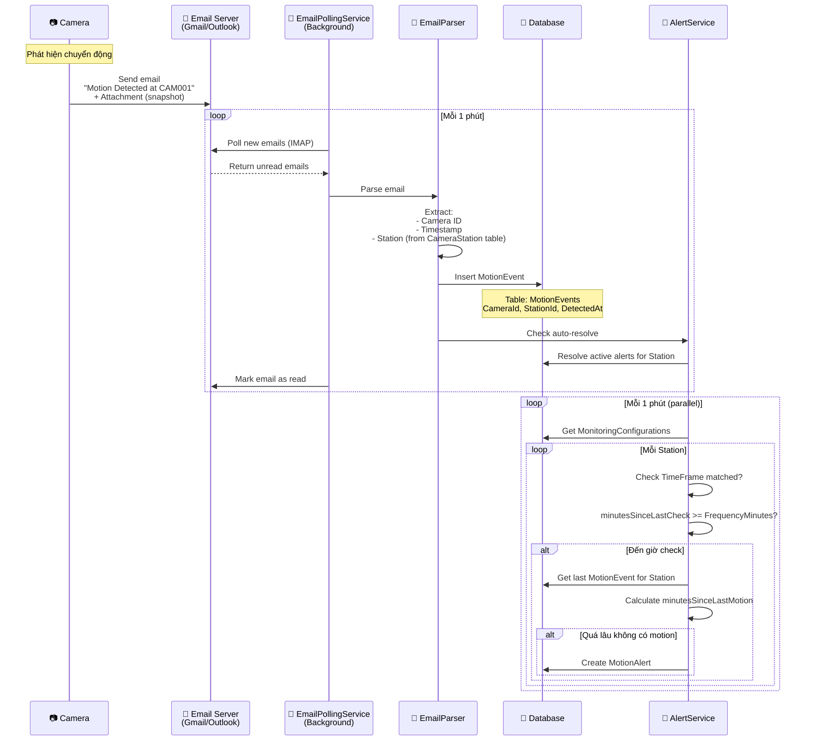

# Kiến trúc Email-based Motion Detection

## 📋 Tóm tắt

**Thay đổi lớn**: Từ **NVR HTTP/TCP Push** → **Email Pull** từ Camera

### Lý do thay đổi:
- NVR không hỗ trợ HTTP webhook push
- Camera Dahua có tính năng **Email Notification** khi phát hiện chuyển động
- Hệ thống sẽ **đọc email** và parse thông tin motion event

---

## 🏗️ Kiến trúc Mới

### Luồng hoạt động



---

## 📂 Components Mới

### 1. EmailPollingService (Background Service)

```csharp
public class EmailPollingService : BackgroundService
{
    private readonly IEmailReaderService _emailReader;
    private readonly IMotionEventService _motionEventService;
    
    protected override async Task ExecuteAsync(CancellationToken stoppingToken)
    {
        while (!stoppingToken.IsCancellationRequested)
        {
            try
            {
                // Đọc emails mới từ inbox
                var emails = await _emailReader.GetUnreadEmailsAsync();
                
                foreach (var email in emails)
                {
                    // Parse email để lấy thông tin motion
                    var motionInfo = ParseMotionEmail(email);
                    
                    if (motionInfo != null)
                    {
                        // Lưu vào database
                        await _motionEventService.ProcessMotionEventAsync(
                            motionInfo.CameraId,
                            motionInfo.EventType,
                            motionInfo.Payload
                        );
                        
                        // Mark email as read
                        await _emailReader.MarkAsReadAsync(email.Id);
                    }
                }
            }
            catch (Exception ex)
            {
                _logger.LogError(ex, "[EmailPolling] Error occurred");
            }
            
            // Poll mỗi 1 phút
            await Task.Delay(TimeSpan.FromMinutes(1), stoppingToken);
        }
    }
    
    private MotionInfo? ParseMotionEmail(EmailMessage email)
    {
        // Parse email subject: "Motion Detected at CAM001"
        // Parse email body: timestamp, location, etc.
        // Parse attachment: snapshot image
        
        return new MotionInfo
        {
            CameraId = ExtractCameraId(email.Subject),
            EventType = "Motion",
            DetectedAt = email.ReceivedTime,
            Payload = JsonSerializer.Serialize(new {
                Subject = email.Subject,
                Body = email.Body,
                AttachmentCount = email.Attachments.Count
            })
        };
    }
}
```

### 2. EmailReaderService (IMAP Client)

```csharp
public interface IEmailReaderService
{
    Task<List<EmailMessage>> GetUnreadEmailsAsync();
    Task MarkAsReadAsync(string emailId);
    Task<byte[]?> GetAttachmentAsync(string emailId, string attachmentName);
}

public class EmailReaderService : IEmailReaderService
{
    private readonly EmailSettings _settings;
    
    public async Task<List<EmailMessage>> GetUnreadEmailsAsync()
    {
        using var client = new ImapClient();
        await client.ConnectAsync(_settings.ImapServer, _settings.ImapPort, SecureSocketOptions.SslOnConnect);
        await client.AuthenticateAsync(_settings.Username, _settings.Password);
        
        var inbox = client.Inbox;
        await inbox.OpenAsync(FolderAccess.ReadWrite);
        
        // Lấy emails chưa đọc
        var uids = await inbox.SearchAsync(SearchQuery.NotSeen);
        var messages = new List<EmailMessage>();
        
        foreach (var uid in uids)
        {
            var message = await inbox.GetMessageAsync(uid);
            messages.Add(new EmailMessage
            {
                Id = uid.ToString(),
                Subject = message.Subject,
                From = message.From.ToString(),
                ReceivedTime = message.Date.DateTime,
                Body = message.TextBody ?? message.HtmlBody,
                Attachments = message.Attachments.Select(a => new EmailAttachment
                {
                    FileName = a.ContentDisposition?.FileName ?? "unknown",
                    ContentType = a.ContentType.MimeType
                }).ToList()
            });
        }
        
        await client.DisconnectAsync(true);
        return messages;
    }
    
    public async Task MarkAsReadAsync(string emailId)
    {
        // Mark email as read/seen
    }
}
```

### 3. EmailSettings (Configuration)

```csharp
public class EmailSettings
{
    public string ImapServer { get; set; } = "imap.gmail.com";
    public int ImapPort { get; set; } = 993;
    public string Username { get; set; } = string.Empty;
    public string Password { get; set; } = string.Empty; // hoặc App Password
    public string InboxFolder { get; set; } = "INBOX";
    public string ProcessedFolder { get; set; } = "Processed"; // Move after processing
}
```

**appsettings.json**:
```json
{
  "EmailSettings": {
    "ImapServer": "imap.gmail.com",
    "ImapPort": 993,
    "Username": "motion-alerts@yourdomain.com",
    "Password": "your-app-password",
    "InboxFolder": "INBOX",
    "ProcessedFolder": "Processed/MotionEvents"
  }
}
```

---

## 📧 Email Format từ Camera

### Subject Line Patterns

Dahua cameras thường gửi email với subject:
- `Motion Detection Alarm` 
- `[Camera Name] Motion Detected`
- `Alarm: Motion at 2025-11-08 10:30:45`

### Email Body

```
Camera: CAM001
Event Type: Motion Detection
Time: 2025-11-08 10:30:45
Location: Main Entrance
Duration: 5 seconds

[Snapshot image attached]
```

### Attachments

- **Snapshot**: `snapshot_CAM001_20251108_103045.jpg`
- Có thể lưu vào storage (Azure Blob, AWS S3, local file system)

---

## 🔧 Cấu hình Camera Dahua

### Bước 1: Enable Motion Detection
```
Camera Web UI → Event → Motion Detection
✅ Enable
✅ Sensitivity: 50
✅ Area: Select zones
```

### Bước 2: Configure Email Notification
```
Camera Web UI → Network → Email (SMTP)

SMTP Server: smtp.gmail.com
Port: 587
SSL/TLS: ✅ Enable
Username: motion-alerts@yourdomain.com
Password: app-password

Event → Motion Detection → Link to Email:
✅ Send Email when motion detected
Interval: 1 minute (avoid spam)
Attach snapshot: ✅
```

### Bước 3: Test Email
```
Event → Test Email
→ Check inbox for test message
```

---

## 🗃️ Database Schema (Updated)

### MotionEvent (Không thay đổi nhiều)

```csharp
public class MotionEvent
{
    public string Id { get; set; } = Guid.NewGuid().ToString();
    
    public string CameraId { get; set; } = string.Empty;
    public string? CameraName { get; set; }
    
    // ✅ NEW: Email source
    public string? EmailId { get; set; }
    public string? EmailSubject { get; set; }
    
    // Optional: Snapshot storage
    public string? SnapshotPath { get; set; } // Path to saved image
    
    public string EventType { get; set; } = "Motion";
    public string? Payload { get; set; }
    public DateTime DetectedAt { get; set; } = DateTime.Now;
    public bool IsProcessed { get; set; }
    
    // Navigation
    public int? StationId { get; set; }
    public Station? Station { get; set; }
}
```

### EmailProcessingLog (New table - optional)

```csharp
public class EmailProcessingLog
{
    public int Id { get; set; }
    public string EmailId { get; set; } = string.Empty;
    public string Subject { get; set; } = string.Empty;
    public DateTime ReceivedAt { get; set; }
    public DateTime ProcessedAt { get; set; } = DateTime.Now;
    public bool Success { get; set; }
    public string? ErrorMessage { get; set; }
    public string? ExtractedCameraId { get; set; }
    public string? MotionEventId { get; set; } // FK to MotionEvent
}
```

---

## 📦 NuGet Packages Cần thiết

```xml
<PackageReference Include="MailKit" Version="4.3.0" />
<PackageReference Include="MimeKit" Version="4.3.0" />
```

**MailKit**: IMAP client để đọc email từ Gmail/Outlook/Exchange

---

## 🚀 Implementation Steps

### Phase 1: Email Infrastructure (2-3 giờ)
1. ✅ Create `EmailSettings` model
2. ✅ Create `IEmailReaderService` interface
3. ✅ Implement `EmailReaderService` using MailKit
4. ✅ Add `EmailSettings` to appsettings.json
5. ✅ Register services in Program.cs

### Phase 2: Email Polling Service (2 giờ)
1. ✅ Create `EmailPollingService : BackgroundService`
2. ✅ Implement email polling loop (every 1 minute)
3. ✅ Implement email parsing logic
4. ✅ Extract Camera ID from subject/body
5. ✅ Map Camera → Station via CameraStation table

### Phase 3: Update MotionEvent (1 giờ)
1. ✅ Add `EmailId`, `EmailSubject`, `SnapshotPath` fields
2. ✅ Migration: `dotnet ef migrations add AddEmailFields`
3. ✅ Update `ProcessMotionEventAsync()` to accept email source

### Phase 4: Snapshot Storage (1 giờ)
1. ✅ Download attachment from email
2. ✅ Save to local storage: `wwwroot/snapshots/{stationId}/{timestamp}.jpg`
3. ✅ Or upload to cloud storage (Azure Blob, S3)
4. ✅ Store path in `MotionEvent.SnapshotPath`

### Phase 5: Alert Logic (giữ nguyên)
1. ✅ MotionMonitoringService chạy mỗi 1 phút
2. ✅ Check theo TimeFrame.FrequencyMinutes
3. ✅ Auto-resolve alerts khi có motion mới
4. ✅ Snapshot configuration

### Phase 6: Testing (1-2 giờ)
1. ✅ Configure camera to send test emails
2. ✅ Verify email parsing
3. ✅ Verify MotionEvent creation
4. ✅ Verify alert creation/resolution
5. ✅ Test with multiple cameras

### Phase 7: UI (1 giờ)
1. ✅ Display snapshot in alert details
2. ✅ Show email source info
3. ✅ Add email processing log viewer

---

## ⚠️ Considerations

### 1. Email Delay
- Email delivery không real-time (có thể delay 10-30 giây)
- Polling interval: 1 phút → Delay tối đa ~1.5 phút

### 2. Email Spam/Filtering
- Camera gửi quá nhiều emails → Gmail có thể filter/block
- **Giải pháp**: 
  - Tăng interval giữa các emails (camera settings)
  - Dùng dedicated email account
  - Dùng Gmail filter rules để auto-label

### 3. Camera Subject Format
- Mỗi hãng camera có format khác nhau
- Cần parse flexible:
  - Regex patterns
  - Keyword matching
  - Fallback to "Unknown Camera"

### 4. Snapshot Storage
- Email attachments có thể lớn (100-500KB/snapshot)
- **Giải pháp**:
  - Cleanup policy: Xóa snapshots cũ hơn 30 ngày
  - Compress images
  - Upload to cloud storage

### 5. Security
- Email password trong appsettings.json
- **Giải pháp**:
  - Dùng User Secrets (Development)
  - Dùng Azure Key Vault (Production)
  - Gmail: Dùng App Password thay vì account password

---

## 🔐 Gmail Setup

### Enable IMAP
```
Gmail Settings → Forwarding and POP/IMAP
✅ Enable IMAP
```

### Create App Password
```
Google Account → Security → 2-Step Verification → App passwords
→ Generate password for "Mail" app
→ Copy 16-character password
```

### Use in appsettings.json
```json
{
  "EmailSettings": {
    "ImapServer": "imap.gmail.com",
    "ImapPort": 993,
    "Username": "your-email@gmail.com",
    "Password": "abcd efgh ijkl mnop"  // App password (no spaces)
  }
}
```

---

## 📊 Comparison: HTTP vs Email

| Aspect | HTTP Webhook (Old) | Email Polling (New) |
|--------|-------------------|---------------------|
| **Real-time** | ✅ Instant (~100ms) | ⚠️ Delayed (~1-2 min) |
| **Reliability** | ⚠️ NVR không hỗ trợ | ✅ Camera hỗ trợ native |
| **Setup complexity** | ❌ Phức tạp (NVR config) | ✅ Đơn giản (camera web UI) |
| **Snapshot** | ⚠️ Cần request riêng | ✅ Attached sẵn |
| **Infrastructure** | HTTP server exposed | Email account (secure) |
| **Scaling** | ✅ Nhiều cameras OK | ⚠️ Email quota limits |
| **Cost** | Free | Free (Gmail limits) |

---

## 🎯 Kết luận

**Email-based approach**:
- ✅ **Khả thi** với camera Dahua hiện tại
- ✅ **Dễ setup** hơn HTTP webhook
- ✅ **Có snapshot** sẵn từ email
- ⚠️ **Delay** 1-2 phút (acceptable cho monitoring)
- ⚠️ **Email limits** cần lưu ý

**Khuyến nghị**: Implement email-based solution, có thể bổ sung HTTP webhook sau nếu NVR hỗ trợ.

---

**Tạo bởi**: AI Analysis  
**Ngày**: 2025-11-08  
**Version**: 1.0
