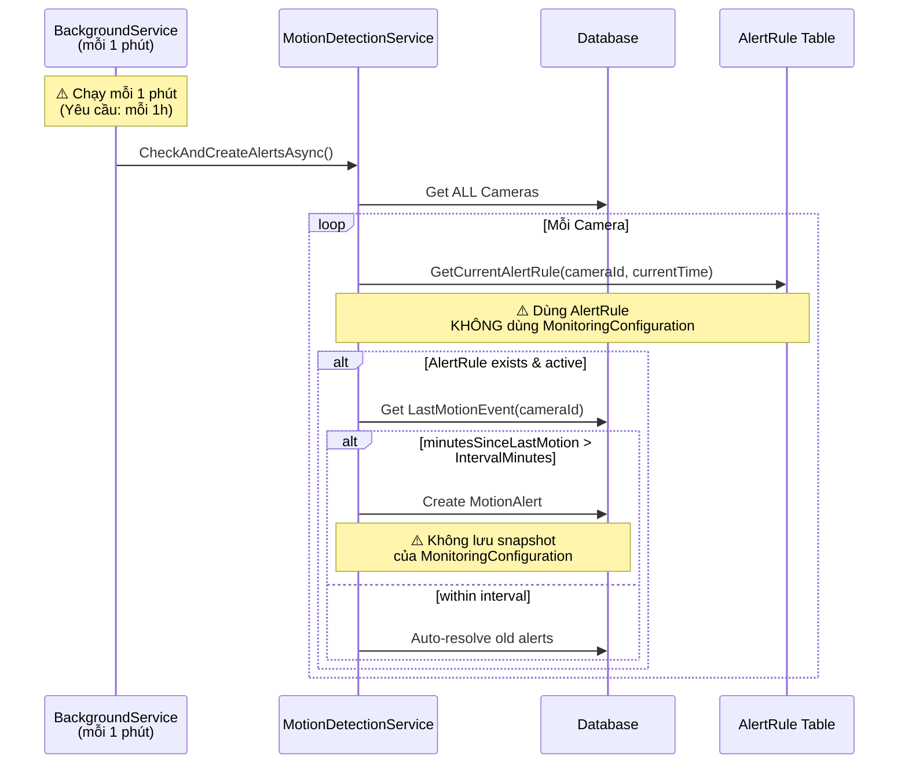

# Phân tích Luồng Giám Sát Hiện Tại vs Yêu Cầu

## 📋 Tóm tắt Executive

**Kết luận**: Hệ thống hiện tại **CHƯA ĐẠT** yêu cầu nghiệp vụ. Cần thiết kế lại để phù hợp với mô hình **Station-based Monitoring** thay vì **Camera-based Monitoring**.

---

## 🎯 Yêu cầu Nghiệp Vụ

### 2. Cấu hình Giám sát (Monitoring Profiles & Schedule)
- ✅ Tạo nhiều **khung thời gian** (TimeFrame) trong ngày
- ❌ Mỗi **TRẠM** có tần suất khác nhau (hiện tại: Camera)
- ✅ Bật/tắt từng khung
- ⚠️ Thay đổi mới chỉ áp dụng từ thời điểm cập nhật

### 3. Nhật ký Chuyển động (Motion Events)
- ✅ Nhận sự kiện từ NVR
- ✅ Ghi thời điểm phát hiện
- ❌ Ghi theo **TRẠM** (hiện tại: Camera)

### 4. Sinh Cảnh báo (Monitoring Alerts)
- ❌ Service chạy theo **TimeFrame.FrequencyMinutes** được cấu hình (hiện tại: hard-coded 1 phút cho TẤT CẢ)
- ❌ Lấy **TRẠM** có IsActive = 1 (hiện tại: Camera)
- ❌ Tìm khung khớp với giờ hiện tại từ **TimeFrame**
- ❌ Check theo `MonitoringConfiguration.IsEnabled` (hiện tại dùng AlertRule)
- ⚠️ Lưu snapshot cấu hình (chưa có)
- ✅ Auto-resolve khi có chuyển động

**Quan trọng**: 
- **1 Station có NHIỀU Cameras** (many-to-many qua `CameraStation`)
- **Tần suất check** khác nhau cho mỗi Station, được cấu hình trong `TimeFrame.FrequencyMinutes`
- Ví dụ: Station A check mỗi 30 phút, Station B check mỗi 2 giờ

---

## 🏗️ Kiến trúc Hiện tại

### Database Schema

```
┌─────────────────────────┐
│ MonitoringConfiguration │  (Liên kết Station → Profile)
│─────────────────────────│
│ + Id                    │
│ + Name                  │
│ + StationId  ───────┐   │  ✅ 1 Station có NHIỀU Cameras
│ + ProfileId         │   │
│ + IsEnabled         │   │
└─────────────────────┘   │
                          │
        ┌─────────────────┼──────────────┐
        │                 │              │
        ▼                 ▼              │
┌──────────────┐  ┌──────────────────┐  │
│   Station    │  │ MonitoringProfile│  │
│──────────────│  │──────────────────│  │
│ + Id         │  │ + Id             │  │
│ + Name       │  │ + Name           │  │
│ + IsActive   │  │ + IsActive       │  │
│              │  │ + TimeFrames[]   │  │
│ Cameras[]────┼──┐└──────────────────┘ │
└──────────────┘  │         │            │
                  │         ▼            │
        ┌─────────┼──┌──────────────────┐│
        │         │  │    TimeFrame     ││
┌───────┴──────┐  │  │──────────────────││
│CameraStation │  │  │ + StartTime      ││
│ (Junction)   │  │  │ + EndTime        ││
│──────────────│  │  │ + FrequencyMin ✅││ ← Tần suất check khác nhau mỗi Station!
│+ CameraId    │  │  │ + DaysOfWeek     ││
│+ StationId   │  │  │ + IsEnabled      ││
└──────────────┘  │  └──────────────────┘│
        │         │                       │
        ▼         │                       │
┌──────────────┐  │                       │
│  CameraInfo  │  │                       │
│──────────────│  │                       │
│ + Id         │  │                       │
│ + Name       │  │                       │
└──────────────┘  │                       │
                  │                       │
┌─────────────────────────┐               │
│     MotionEvent         │  (❌ Chưa liên kết Station!)
│─────────────────────────│               │
│ + CameraId              │               │
│ + CameraName            │               │
│ + DetectedAt            │               │
│ ❌ StationId (THIẾU)    │               │
└─────────────────────────┘               │
                                          │
┌─────────────────────────┐               │
│     MotionAlert         │  (❌ Không dùng MonitoringConfiguration!)
│─────────────────────────│               │
│ + CameraId              │               │
│ + AlertTime             │               │
│ + ExpectedIntervalMin   │ ← ❌ Từ AlertRule, không phải TimeFrame
│ ❌ StationId (THIẾU)    │               │
└─────────────────────────┘
        │
        ▼
┌─────────────────────────┐
│      AlertRule          │  (❌ Table cũ, conflict với MonitoringProfile)
│─────────────────────────│
│ + CameraId              │ ← ❌ Camera-based, không phải Station-based
│ + StartTime             │
│ + EndTime               │
│ + IntervalMinutes       │ ← ❌ Hard-coded, không phải flexible TimeFrame
└─────────────────────────┘
```

### Logic Flow



---

## ❌ Vấn đề Chính

### 1. **Conflict Architecture** - Hai hệ thống song song

| Hệ thống CŨ (AlertRule) | Hệ thống MỚI (MonitoringConfig) | Vấn đề |
|--------------------------|----------------------------------|--------|
| `AlertRule` table | `MonitoringConfiguration` + `TimeFrame` | **Cả 2 đều tồn tại** nhưng không liên kết |
| Camera-based | Station-based | **Khác đơn vị giám sát** |
| `GetCurrentAlertRule()` | Không dùng trong service | **Code không dùng config mới** |
| Hard-coded interval | Flexible TimeFrames | **Mâu thuẫn thiết kế** |

### 2. **Camera vs Station** - Sai đơn vị giám sát

```csharp
// YÊU CẦU: Giám sát theo TRẠM
// "Mỗi trạm có thể có tần suất khác nhau"
// 1 Station có NHIỀU Cameras (many-to-many qua CameraStation)

// HIỆN TẠI: Giám sát theo CAMERA ❌
public async Task CheckAndCreateAlertsAsync()
{
    var cameras = await context.Cameras.ToListAsync(); // ❌ Sai!
    foreach (var camera in cameras) 
    {
        var currentRule = await GetCurrentAlertRuleAsync(camera.Id, currentTime);
        // Check từng camera riêng lẻ → Không đúng yêu cầu
    }
}

// NÊN LÀ: Station-based, aggregate motion từ TẤT CẢ cameras của station ✅
public async Task CheckAndCreateAlertsAsync()
{
    var configs = await context.MonitoringConfigurations
        .Include(c => c.Station).ThenInclude(s => s.CameraStations).ThenInclude(cs => cs.Camera)
        .Include(c => c.Profile).ThenInclude(p => p.TimeFrames)
        .Where(c => c.IsEnabled && c.Station.IsActive)
        .ToListAsync();
        
    foreach (var config in configs) 
    {
        // Lấy motion từ BẤT KỲ camera nào của station
        var stationCameraIds = config.Station.CameraStations.Select(cs => cs.CameraId).ToList();
        
        var lastMotionFromAnyCamera = await context.MotionEvents
            .Where(e => stationCameraIds.Contains(e.CameraId))
            .OrderByDescending(e => e.DetectedAt)
            .FirstOrDefaultAsync();
            
        // Nếu BẤT KỲ camera nào có motion → Station có hoạt động
    }
}
```

### 3. **Frequency Mismatch** - Sai tần suất & cách chạy

| Yêu cầu | Hiện tại | Vấn đề |
|---------|----------|--------|
| Service chạy **mỗi 1 phút** (cố định) | ✅ Đúng rồi | Không có vấn đề |
| Logic TRONG service check theo `TimeFrame.FrequencyMinutes` của từng station | ❌ Check TẤT CẢ cameras mỗi lần | Không phân biệt tần suất |
| Mỗi Station có **tần suất riêng**: Station A: 30 phút, Station B: 2 giờ | ❌ Dùng `AlertRule.IntervalMinutes` giống nhau | Hard-coded, không linh hoạt |

**Giải pháp**: 
- Service chạy **mỗi 1 phút** (giữ nguyên)
- Nhưng CHỈ check Station nào "đến giờ" dựa vào `TimeFrame.FrequencyMinutes`

```csharp
// Service chạy mỗi 1 PHÚT (cố định)
await Task.Delay(TimeSpan.FromMinutes(1), stoppingToken);

// Nhưng CHỈ check Station nếu đến "giờ" của nó
foreach (var config in configs)
{
    var timeFrame = GetCurrentTimeFrame(config);
    if (timeFrame == null) continue;
    
    // Check xem đã đủ FrequencyMinutes chưa?
    var minutesSinceLastCheck = GetMinutesSinceLastCheck(config.StationId);
    
    if (minutesSinceLastCheck >= timeFrame.FrequencyMinutes)
    {
        // Đến lượt check station này
        await CheckStationForAlert(config, timeFrame);
    }
    else
    {
        // Skip station này vì chưa đến giờ check
        _logger.LogDebug($"Skip {config.Station.Name}: {minutesSinceLastCheck}/{timeFrame.FrequencyMinutes} min");
    }
}
```

### 4. **Missing Snapshot** - Thiếu lưu snapshot

```csharp
// YÊU CẦU: "Lưu snapshot cấu hình (tần suất, khung giờ, profile)"
// Để audit trail khi config thay đổi

// HIỆN TẠI: MotionAlert không có
public class MotionAlert 
{
    public int ExpectedIntervalMinutes { get; set; }
    // ❌ Thiếu: ProfileId, TimeFrameId, ConfigurationSnapshotJson
}

// NÊN LÀ:
public class MotionAlert 
{
    public int MonitoringConfigurationId { get; set; }
    public int TimeFrameId { get; set; }
    public int ExpectedFrequencyMinutes { get; set; }
    
    // Snapshot at alert time
    public string ConfigurationSnapshot { get; set; } // JSON
}
```

### 5. **No TimeFrame Matching** - Không match khung giờ

```csharp
// YÊU CẦU: "Tìm khung cấu hình khớp với giờ hiện tại"

// HIỆN TẠI: Dùng AlertRule.StartTime/EndTime
var currentRule = await GetCurrentAlertRuleAsync(camera.Id, currentTime);

// NÊN LÀ: Match TimeFrame trong MonitoringProfile
var matchingTimeFrame = config.Profile.TimeFrames
    .FirstOrDefault(tf => 
        tf.IsEnabled &&
        currentTime >= tf.StartTime && 
        currentTime <= tf.EndTime &&
        IsDayOfWeekMatch(tf.DaysOfWeek, DateTime.Now.DayOfWeek)
    );
```

---

## 🔧 Giải pháp Đề xuất

### Phase 1: Sửa Database Schema

```sql
-- 1. Thêm StationId vào MotionEvent
ALTER TABLE MotionEvents ADD StationId INT NULL;
ALTER TABLE MotionEvents ADD CONSTRAINT FK_MotionEvents_Stations 
    FOREIGN KEY (StationId) REFERENCES Stations(Id);

-- 2. Thêm snapshot fields vào MotionAlert
ALTER TABLE MotionAlerts ADD MonitoringConfigurationId INT NULL;
ALTER TABLE MotionAlerts ADD TimeFrameId INT NULL;
ALTER TABLE MotionAlerts ADD ConfigurationSnapshot NVARCHAR(MAX) NULL;
ALTER TABLE MotionAlerts ADD CONSTRAINT FK_MotionAlerts_MonitoringConfigurations
    FOREIGN KEY (MonitoringConfigurationId) REFERENCES MonitoringConfigurations(Id);

-- 3. Migrate Camera → Station relationship
UPDATE MotionEvents 
SET StationId = (SELECT TOP 1 StationId FROM Cameras WHERE Id = MotionEvents.CameraId);

-- 4. Deprecate AlertRule table (optional)
-- DROP TABLE AlertRules; -- hoặc giữ lại cho legacy
```

### Phase 2: Refactor Service Logic

#### MotionMonitoringService.cs
```csharp
public class MotionMonitoringService : BackgroundService
{
    protected override async Task ExecuteAsync(CancellationToken stoppingToken)
    {
        _logger.LogInformation("[MotionMonitor] Service started");

        while (!stoppingToken.IsCancellationRequested)
        {
            try
            {
                await DoWorkAsync();
            }
            catch (Exception ex)
            {
                _logger.LogError(ex, "[MotionMonitor] Error occurred while checking motion alerts");
            }

            // ✅ Chạy mỗi 1 PHÚT (cố định)
            // Logic bên trong sẽ quyết định station nào cần check dựa vào TimeFrame.FrequencyMinutes
            await Task.Delay(TimeSpan.FromMinutes(1), stoppingToken);
        }

        _logger.LogInformation("[MotionMonitor] Service stopped");
    }

    private async Task DoWorkAsync()
    {
        using var scope = _serviceProvider.CreateScope();
        var monitoringService = scope.ServiceProvider.GetRequiredService<IMonitoringService>();

        _logger.LogInformation($"[MotionMonitor] Running check at {DateTime.Now:yyyy-MM-dd HH:mm:ss}");

        await monitoringService.CheckAndCreateAlertsAsync();
    }
}
```

#### MonitoringService.cs (New)
```csharp
public async Task CheckAndCreateAlertsAsync()
{
    using var context = await _contextFactory.CreateDbContextAsync();
    var now = DateTime.Now;
    var currentTime = now.TimeOfDay;
    var currentDay = (int)now.DayOfWeek;
    if (currentDay == 0) currentDay = 7; // Sunday = 7

    // ✅ Lấy TRẠM có monitoring enabled
    var configs = await context.MonitoringConfigurations
        .Include(c => c.Station).ThenInclude(s => s.CameraStations).ThenInclude(cs => cs.Camera)
        .Include(c => c.Profile).ThenInclude(p => p.TimeFrames)
        .Where(c => c.IsEnabled && c.Station.IsActive)
        .ToListAsync();

    foreach (var config in configs)
    {
        // ✅ Tìm TimeFrame khớp với giờ hiện tại
        var matchingTimeFrame = config.Profile.TimeFrames
            .FirstOrDefault(tf => 
                tf.IsEnabled &&
                currentTime >= tf.StartTime && 
                currentTime <= tf.EndTime &&
                tf.DaysOfWeek.Contains(currentDay.ToString())
            );

        if (matchingTimeFrame == null)
            continue;

        // ✅ Check xem đã đủ FrequencyMinutes để check station này chưa?
        var lastCheck = await GetLastCheckTimeAsync(context, config.StationId);
        var minutesSinceLastCheck = lastCheck.HasValue 
            ? (int)(now - lastCheck.Value).TotalMinutes 
            : int.MaxValue;
            
        // Chỉ check nếu đã đủ frequency
        if (minutesSinceLastCheck < matchingTimeFrame.FrequencyMinutes)
        {
            _logger.LogDebug($"[Station {config.Station.Name}] Skipping check, only {minutesSinceLastCheck} minutes since last check (need {matchingTimeFrame.FrequencyMinutes})");
            continue;
        }
        
        // ✅ Lấy tất cả camera IDs của station
        var stationCameraIds = config.Station.CameraStations
            .Select(cs => cs.CameraId)
            .ToList();

        if (!stationCameraIds.Any())
        {
            _logger.LogWarning($"[Station {config.Station.Name}] No cameras assigned");
            continue;
        }

        // ✅ Lấy motion event cuối cùng từ BẤT KỲ camera nào của TRẠM
        var lastMotion = await context.MotionEvents
            .Where(e => stationCameraIds.Contains(e.CameraId))
            .OrderByDescending(e => e.DetectedAt)
            .FirstOrDefaultAsync();

        if (lastMotion == null)
        {
            _logger.LogWarning($"[Alert] No motion detected yet for station {config.Station.Name}");
            
            // Lưu thời gian check
            await UpdateLastCheckTimeAsync(context, config.StationId, now);
            continue;
        }

        var minutesSinceLastMotion = (int)(now - lastMotion.DetectedAt).TotalMinutes;

        // ✅ Check theo FrequencyMinutes của TimeFrame
        if (minutesSinceLastMotion > matchingTimeFrame.FrequencyMinutes)
        {
            // Check xem đã có alert chưa resolve chưa?
            var existingAlert = await context.MotionAlerts
                .Where(a => a.StationId == config.StationId && !a.IsResolved)
                .FirstOrDefaultAsync();

            if (existingAlert == null)
            {
                // ✅ Tạo alert với snapshot
                var alert = new MotionAlert
                {
                    StationId = config.StationId,
                    StationName = config.Station.Name,
                    MonitoringConfigurationId = config.Id,
                    TimeFrameId = matchingTimeFrame.Id,
                    AlertTime = now,
                    Severity = minutesSinceLastMotion > matchingTimeFrame.FrequencyMinutes * 2 
                        ? AlertSeverity.Critical 
                        : AlertSeverity.Warning,
                    Message = $"Không phát hiện chuyển động tại trạm {config.Station.Name} trong {minutesSinceLastMotion} phút (mong đợi: {matchingTimeFrame.FrequencyMinutes} phút)",
                    ExpectedFrequencyMinutes = matchingTimeFrame.FrequencyMinutes,
                    LastMotionAt = lastMotion.DetectedAt,
                    LastMotionCameraId = lastMotion.CameraId,
                    LastMotionCameraName = lastMotion.CameraName,
                    MinutesSinceLastMotion = minutesSinceLastMotion,
                    
                    // ✅ Snapshot configuration
                    ConfigurationSnapshot = JsonSerializer.Serialize(new
                    {
                        ConfigId = config.Id,
                        ConfigName = config.Name,
                        StationId = config.StationId,
                        StationName = config.Station.Name,
                        ProfileName = config.Profile.Name,
                        TimeFrameName = matchingTimeFrame.Name,
                        FrequencyMinutes = matchingTimeFrame.FrequencyMinutes,
                        StartTime = matchingTimeFrame.StartTime,
                        EndTime = matchingTimeFrame.EndTime,
                        DaysOfWeek = matchingTimeFrame.DaysOfWeek,
                        CameraCount = stationCameraIds.Count,
                        CameraIds = stationCameraIds,
                        SnapshotTime = now
                    })
                };

                context.MotionAlerts.Add(alert);
                await context.SaveChangesAsync();
                
                _logger.LogWarning($"[Alert] Created alert for station {config.Station.Name} - {minutesSinceLastMotion} minutes since last motion from any camera");
            }
        }
        else
        {
            // Motion OK, auto-resolve nếu có alert cũ
            var unresolvedAlerts = await context.MotionAlerts
                .Where(a => a.StationId == config.StationId && !a.IsResolved)
                .ToListAsync();

            foreach (var alert in unresolvedAlerts)
            {
                alert.IsResolved = true;
                alert.ResolvedAt = now;
                alert.ResolvedBy = "System Auto-Resolve";
                alert.Notes = $"Motion detected from camera {lastMotion.CameraId} at {lastMotion.DetectedAt:HH:mm:ss}";
            }

            if (unresolvedAlerts.Count > 0)
            {
                await context.SaveChangesAsync();
                _logger.LogInformation($"[Alert] Auto-resolved {unresolvedAlerts.Count} alerts for station {config.Station.Name}");
            }
        }
        
        // Lưu thời gian check
        await UpdateLastCheckTimeAsync(context, config.StationId, now);
    }
}

// Helper: Track last check time per station
private async Task<DateTime?> GetLastCheckTimeAsync(ApplicationDbContext context, int stationId)
{
    var lastAlert = await context.MotionAlerts
        .Where(a => a.StationId == stationId)
        .OrderByDescending(a => a.AlertTime)
        .FirstOrDefaultAsync();
        
    return lastAlert?.AlertTime;
    
    // Hoặc tạo table riêng: StationCheckHistory
}

private async Task UpdateLastCheckTimeAsync(ApplicationDbContext context, int stationId, DateTime checkTime)
{
    // Option 1: Lưu vào cache (in-memory)
    // Option 2: Lưu vào table StationCheckHistory
    // For now: không cần lưu vì có thể dựa vào MotionAlert.AlertTime
}
```

### Phase 3: Update Models

#### MotionEvent.cs
```csharp
public class MotionEvent
{
    public string Id { get; set; } = Guid.NewGuid().ToString();
    
    // Keep for backwards compatibility
    public string? CameraId { get; set; }
    public string? CameraName { get; set; }
    
    // ✅ NEW: Station reference (optional, có thể tính từ Camera)
    public int? StationId { get; set; }
    public Station? Station { get; set; }
    
    public string EventType { get; set; } = "Motion";
    public string? Payload { get; set; }
    public DateTime DetectedAt { get; set; } = DateTime.Now;
    public bool IsProcessed { get; set; }
}

// Note: StationId có thể NULL vì:
// 1. Legacy data chưa có StationId
// 2. Camera có thể chưa assign vào Station nào
// 3. Có thể tính StationId từ CameraStation junction table khi cần
```

#### MotionAlert.cs
```csharp
public class MotionAlert
{
    public string Id { get; set; } = Guid.NewGuid().ToString();
    
    // ✅ NEW: Station-based (PRIMARY)
    public int? StationId { get; set; }
    public Station? Station { get; set; }
    public string? StationName { get; set; }
    
    // ✅ NEW: Configuration references
    public int? MonitoringConfigurationId { get; set; }
    public MonitoringConfiguration? MonitoringConfiguration { get; set; }
    
    public int? TimeFrameId { get; set; }
    public TimeFrame? TimeFrame { get; set; }
    
    // ✅ NEW: Snapshot for audit
    public string? ConfigurationSnapshot { get; set; }
    
    public DateTime AlertTime { get; set; } = DateTime.Now;
    public AlertSeverity Severity { get; set; }
    public string Message { get; set; } = string.Empty;
    
    public int ExpectedFrequencyMinutes { get; set; }
    public DateTime LastMotionAt { get; set; }
    public int MinutesSinceLastMotion { get; set; }
    
    // ✅ NEW: Track which camera had last motion
    public string? LastMotionCameraId { get; set; }
    public string? LastMotionCameraName { get; set; }
    
    public bool IsResolved { get; set; }
    public DateTime? ResolvedAt { get; set; }
    public string? ResolvedBy { get; set; }
    public string? Notes { get; set; }
    
    // Keep for backwards compatibility (deprecated)
    [Obsolete("Use StationId instead")]
    public string? CameraId { get; set; }
    
    [Obsolete("Use StationName instead")]
    public string? CameraName { get; set; }
}
```

---

## 📊 So sánh Trước/Sau

| Aspect | Hiện tại ❌ | Sau khi sửa ✅ |
|--------|-------------|----------------|
| **Đơn vị giám sát** | Camera (riêng lẻ) | Station (aggregate từ nhiều cameras) |
| **Relationship** | 1 Camera = 1 Alert | 1 Station (nhiều cameras) = 1 Alert |
| **Cấu hình** | AlertRule (hard-coded) | MonitoringConfiguration + Profile + TimeFrame |
| **Tần suất service** | Mỗi 1 phút (check TẤT CẢ cameras) | ✅ Mỗi 1 phút (nhưng chỉ check stations "đến giờ") |
| **Tần suất check station** | Không phân biệt | Theo `TimeFrame.FrequencyMinutes` của từng station |
| **Match khung giờ** | AlertRule.StartTime/EndTime | TimeFrame.StartTime/EndTime + DaysOfWeek |
| **Tần suất alert** | AlertRule.IntervalMinutes | TimeFrame.FrequencyMinutes (linh hoạt mỗi station) |
| **Motion detection** | Từ 1 camera | Từ BẤT KỲ camera nào của station |
| **Snapshot config** | Không có | ConfigurationSnapshot (JSON) + track camera có motion cuối |
| **Audit trail** | Thiếu | Đầy đủ (profile, timeframe, frequency, cameras) |
| **Auto-resolve** | Có ✅ | Có ✅ (giữ nguyên) |
| **Thay đổi config** | Ảnh hưởng ngay | Áp dụng từ thời điểm update (vì có snapshot) |
| **Ví dụ** | Camera A check 1 phút, Camera B check 1 phút | Station 1 check 30 phút, Station 2 check 2 giờ |

---

## 🚀 Migration Plan

### Step 1: Database Migration (30 phút)
```bash
dotnet ef migrations add AddStationBasedMonitoring
dotnet ef database update
```

### Step 2: Update Models (15 phút)
- MotionEvent: Add StationId
- MotionAlert: Add StationId, ConfigurationId, TimeFrameId, Snapshot

### Step 3: Refactor Services (1 giờ)
- MotionMonitoringService: Change interval to 1 hour
- MotionDetectionService: Rewrite CheckAndCreateAlertsAsync()
- Add TimeFrame matching logic

### Step 4: Update UI (30 phút)
- MonitoringSettings page: Show correct relationships
- Alert dashboard: Display station-based alerts

### Step 5: Data Migration (15 phút)
```sql
-- Migrate existing MotionEvents to have StationId
UPDATE MotionEvents 
SET StationId = (SELECT TOP 1 StationId FROM Cameras WHERE Id = MotionEvents.CameraId)
WHERE StationId IS NULL;
```

### Step 6: Testing (1 giờ)
- Test TimeFrame matching
- Test alert creation with snapshot
- Test auto-resolve
- Test config changes don't affect existing alerts

---

## ✅ Checklist Hoàn thành

- [ ] Database schema updated (StationId, snapshot fields)
- [ ] Models updated (MotionEvent, MotionAlert)
- [ ] Service logic refactored (station-based, 1h interval)
- [ ] TimeFrame matching implemented
- [ ] Configuration snapshot implemented
- [ ] Auto-resolve tested
- [ ] UI updated
- [ ] Data migration completed
- [ ] Documentation updated
- [ ] Testing completed

---

## 📝 Notes

1. **Backwards Compatibility**: Giữ lại `CameraId` trong models để không break existing data
2. **AlertRule Table**: Có thể deprecate sau khi migrate xong
3. **Snapshot JSON**: Dùng để audit và debug, không dùng để tính toán
4. **Performance**: 1h interval → giảm 60x số lần query database
5. **Testing**: Cần test kỹ logic match TimeFrame với DaysOfWeek

---

**Tạo bởi**: AI Analysis
**Ngày**: 2025-11-08
**Version**: 1.0
